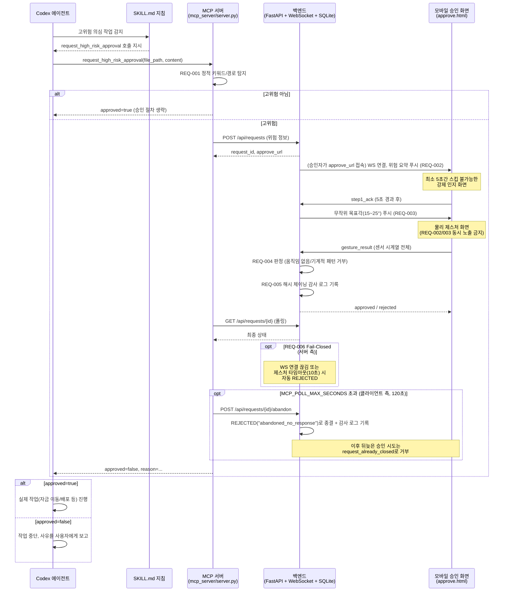

# High-Risk Guard

## Title & Description

**High-Risk Guard** — AI 에이전트(Codex)가 자금 이동 로직 수정, 프로덕션 배포 등 고위험
작업을 시도할 때, 인간 관리자가 모바일 기기의 물리적 제스처로 의도적 승인을 해야만 작업이
진행되도록 하는 감사(Audit) 시스템. 개념 증명(PoC) 수준의 MVP다.

## Features

- **REQ-001 고위험 작업 탐지**: 자금/배포 관련 키워드 및 경로에 대한 정적 매칭으로 AI
  에이전트의 코드 변경을 인터셉트한다.
- **REQ-002 강제 인지 단계**: 승인자는 위험 diff 요약을 최소 5초간 스킵 없이 확인해야
  다음 단계로 진입할 수 있다.
- **REQ-003 물리 제스처 승인**: 무작위 목표 각도로 기기를 기울여 1초 이상 유지해야
  승인이 완료된다. 두 단계는 절대 동시에 노출되지 않는다.
- **REQ-004 실수·매크로 거부**: 서버가 제출된 센서 시계열 자체를 재검증해, 움직임 없는
  단순 탭이나 기계적으로 규칙적인 패턴(매크로)을 거부한다.
- **REQ-005 감사 로그**: 모든 승인/거부 결과를 해시 체이닝된 SQLite 로그로 남기며,
  애플리케이션 레이어에서 삭제 API를 제공하지 않는다.
- **REQ-006 Fail-Closed**: 연결이 끊기거나 응답이 없으면 자동으로 작업을 폐기(Abort)하며,
  승인자가 아예 요청을 열어보지 않는 경우도 별도 상한 이후 "포기됨" 상태로 명시적으로
  종결된다.

## Prerequisites

- Python 3.11+ (개발/검증은 3.14 환경에서 진행)
- Codex CLI (플러그인 실행 확인은 `@openai/codex@0.144.1` 기준)
- 모바일 브라우저: `DeviceOrientation` API 지원 필요 (iOS Safari 16+, Android Chrome 최신)
- 승인 화면 접속을 위한 HTTPS 환경 (iOS의 센서 권한 정책상 필수)

## Installation

```bash
cd src
pip install -r requirements.txt
```

`requirements.txt`는 버전이 고정되어 있으며(`mcp==1.28.1`, `fastapi==0.139.0` 등),
fresh venv에서 동일 버전으로 재현되는 것까지 확인했다.

## Usage

이 플러그인은 서로 다른 세 개의 프로세스로 구성된다 — **전부 별도로 떠 있어야 한다.**

### 1. 백엔드 (FastAPI + WebSocket) 기동

승인 요청 상태 머신, 모바일 승인 화면 서빙, REQ-005 감사 로그를 전부 이 프로세스가 담당한다.

```bash
# src/ 에서
uvicorn backend.app:app --host 0.0.0.0 --port 8000
```

### 2. MCP 서버를 Codex 플러그인으로 로드

`src/`가 플러그인 루트다. Codex CLI에 로컬 마켓플레이스로 등록해서 로드한다:

```bash
mkdir -p .agents/plugins
cat > .agents/plugins/marketplace.json <<'EOF'
{
  "name": "high-risk-guard-dev",
  "plugins": [
    { "name": "high-risk-guard",
      "source": { "source": "local", "path": "./src" },
      "policy": { "installation": "AVAILABLE", "authentication": "ON_INSTALL" },
      "category": "Productivity" }
  ]
}
EOF
codex plugin marketplace add .
codex plugin add high-risk-guard@high-risk-guard-dev
```

로드되면 Codex는 `.mcp.json`에 정의된 대로 `python -m mcp_server.server`를
(cwd=`src/`, `PYTHONPATH=.`) stdio로 자동 스폰한다. MCP 서버는 백엔드와 HTTP(기본
`http://127.0.0.1:8000`, `HIGH_RISK_GUARD_BACKEND_URL` 환경변수로 변경 가능)로만
통신하므로, **1번의 백엔드가 먼저 떠 있어야 정상 동작한다.**

### 3. 모바일 승인 화면

Codex가 고위험 작업을 감지해 `request_high_risk_approval`을 호출하면, 반환되는
`approve_url`(예: `http://<backend-host>:8000/mobile/approve.html?request_id=...`)을
승인자가 모바일 브라우저로 열면 된다. 별도 프론트엔드 빌드 없이 순수 HTML/CSS/JS 1파일이며
백엔드가 정적 파일로 서빙한다.

### 사용 예시 흐름

1. Codex가 `/src/wallet/transfer.py`를 수정하려 시도한다.
2. SKILL.md 지침에 따라 Codex가 `request_high_risk_approval`을 호출한다.
3. 관리자 폰에 승인 요청이 푸시되고, 위험 diff를 5초간 확인한 뒤 목표각을 맞춰 승인한다.
4. Codex는 `approved: true` 응답을 받은 뒤에만 실제 파일 변경을 진행한다.

## 아키텍처



세 프로세스가 반드시 분리되는 이유: MCP 서버(Codex가 stdio로 직접 스폰)와 백엔드(사람이
`uvicorn`으로 별도 기동)는 서로 다른 생명주기를 가지며, 모바일 화면은 또 다른 물리적
기기(승인자의 폰)에서 열린다. 셋 다 HTTP/WS로만 통신하고 프로세스 메모리를 공유하지 않는다.

## 테스트 및 검증

```bash
cd src
pytest                                    # 전체 자동화 테스트 36건
python scripts/verify_req001_detection.py     # REQ-001 탐지 실측
python scripts/verify_req004_macro_rejection.py  # REQ-004 거부 실측
python scripts/verify_req006_fail_closed.py      # REQ-006 Fail-Closed 실측
```

정량적 목표치(탐지율 90% 등)를 과장하지 않고, 실행 결과를 있는 그대로 기록한다.

- `verify_req001_detection.py`: 난독화된 고위험 커밋 10건 중 **3건 탐지**됨
  (동의어 치환, camelCase 접합, 문자열 분할, homoglyph, base64 인코딩 등은 통과함 —
  REQ-001이 정적 키워드/경로 매칭이라는 점을 감안하면 예상된 결과).
- `verify_req004_macro_rejection.py`: 매크로/단순 탭 시도 10건 중 **10건 거부**됨.
- `verify_req006_fail_closed.py`: 실제 백엔드 서브프로세스 + 실제 WebSocket 연결로 검증.
  - A) WebSocket 강제 단절 → **Pass** (`disconnected_fail_closed`)
  - B) 제스처 타임아웃(기본 10초) → **Pass** (`timeout_fail_closed`)
- 포기된(abandoned) 요청 처리(`pytest`, `test_server_approval_wiring.py`):
  - 폴링 타임아웃 도달 시 `REJECTED("abandoned_no_response")`로 명시적 종결 → **Pass**
  - 종결 이후 뒤늦은 승인 시도는 `request_already_closed`로 거부 → **Pass**

전체 자동화 테스트: 36개 전부 통과 (REQ-001 탐지 16건, REQ-002~004 백엔드
상태머신/제스처 판정 17건, REQ-005 감사 로그 4건, MCP↔백엔드 연동 5건; 일부 항목은
여러 REQ를 동시에 검증하므로 합산 시 36과 다를 수 있음).

> 알려진 사소한 이슈: `pytest` 실행 시 `StarletteDeprecationWarning: Using httpx with
> starlette.testclient is deprecated; install httpx2 instead` 경고가 출력된다.
> 테스트 결과나 기능에는 영향이 없으며, 이번 제출에서는 손대지 않았다.

## CI/CD

이번 제출은 `submission.zip` 단일 파일 형식이라 실제로 트리거되는 CI 파이프라인은
구성하지 않았다. 다만 위 테스트/검증 스크립트가 모두 결정론적으로 재현 가능한 CLI
명령이므로, 저장소로 옮겨질 경우 아래와 같은 워크플로로 바로 연결할 수 있다 (참고용,
현재 리포지토리에는 포함하지 않음):

```yaml
# 참고용 예시 — 현재 제출물에는 포함되어 있지 않음
name: test
on: [push, pull_request]
jobs:
  test:
    runs-on: ubuntu-latest
    steps:
      - uses: actions/checkout@v4
      - uses: actions/setup-python@v5
        with:
          python-version: "3.11"
      - run: pip install -r src/requirements.txt
      - run: cd src && pytest
      - run: cd src && python scripts/verify_req001_detection.py
      - run: cd src && python scripts/verify_req004_macro_rejection.py
      - run: cd src && python scripts/verify_req006_fail_closed.py
```

## 미해결 한계 총정리

과장 없이, 각 항목이 지금 시점에 해결되지 않은 이유까지 함께 적는다.

| 항목 | 한계 내용 | 왜 지금 해결하지 않았는가 |
|---|---|---|
| REQ-001 정적 매칭 우회 가능 | 동의어 치환, 문자열 분할+간접 호출, 유니코드 homoglyph, base64 인코딩 등으로 탐지를 피할 수 있다 (검증 스크립트 실측: 10건 중 3건만 탐지) | AST 기반 정적 분석이 필요하지만 해커톤 범위에서 파서 구현이 비현실적. SRS에 "미해결 한계"로 명시된 항목이라 의도적으로 범위에서 제외 |
| camelCase word-boundary 보강 시도/철회 | `transferAmount`처럼 키워드가 camelCase로 다음 단어에 바로 붙으면 미탐된다. 대문자 전환을 경계로 인정하는 보강을 시도했으나, 자금/배포와 무관한 실제 있을 법한 camelCase 식별자 8개 중 8개(100%)가 새로 오탐되어 되돌림 | `transferAmount`(자금)와 `transferAmount`(UI 애니메이션)는 문자열만으로 구별 불가능 — 정규식 수준에서 해결 불가능한 문제로 판단, 원복 |
| diff 인지와 물리 동작의 결합 불완전 | REQ-002(강제 노출 단계)는 "화면에 노출되었다"만 보장할 뿐 "내용을 이해했다"를 증명하지 못한다. REQ-003 제스처도 diff 이해의 증명이 아니라 무의식적 연타/매크로를 거르는 용도일 뿐 | SRS에서 처음부터 "diff 이해 증명 수단이 아님"으로 범위를 명확히 한정함. 실질적 결합 증명에는 사용자 인지 측정(예: 아이트래킹) 등이 필요해 범위 밖 |
| mock 생체인증 | REQ-005 감사 로그의 `mock_biometric_verified_at`는 실제 FaceID/지문 인증이 아니라 "REQ-002를 통과해 제스처 화면에 진입한 시각"을 대신 기록한 것 | 실기기 생체인증 API 연동이 이번 MVP 범위 밖으로 정의됨 (요구사항정의서 3장) |
| 인프라 레벨 WORM 아님 | REQ-005 해시 체이닝은 애플리케이션 레이어에 삭제 API가 없다는 것과 `verify_chain()`으로 사후 위변조를 탐지 가능하다는 것만 보장. SQLite 파일에 직접 접근 가능한 DB 관리자의 조작 자체는 막지 못함 | 인프라 레벨 Append-Only(WORM) 저장소는 SRS 4장에 "미해결 한계"로 명시되어 의도적으로 범위에서 제외 |
| REQ-002 단계 서버 측 타임아웃 없음 | 제스처 화면 진입 전(위험 인지 단계)에는 승인자가 시간을 얼마나 쓰든 서버가 강제로 끊지 않는다. 대신 MCP 클라이언트 측에 별도 상한(`MCP_POLL_MAX_SECONDS`, 기본 120초)을 두고, 초과 시 `/abandon`으로 백엔드 상태를 명시적으로 종결시킨다 | 승인자가 위험 내용을 충분히 읽을 시간을 서버가 강제로 제한하는 것은 REQ-002의 취지(강제 인지)와 맞지 않다고 판단, 대신 Codex 쪽 호출이 무한 대기하지 않도록 클라이언트 레벨에서만 상한을 둠 |
| Codex의 자발적 스킬 호출 미검증 | "Codex가 `/src/wallet/` 등 고위험 작업을 시도할 때 SKILL.md 지침을 보고 실제로 자발적으로 `request_high_risk_approval`을 호출하는가"는 아직 실측하지 않았다 | 이는 결정론적으로 보장할 수 없는 LLM 행동 영역이라 별도 시나리오 테스트가 필요한데, 이번 제출 시점까지 진행하지 못함 |
| 다중서명 비상 오버라이드 미구현 | 승인자가 부재중일 때 우회할 수 있는 오프라인/비상 승인 채널이 없다 | 오프라인 채널 설계와 남용 방지 장치(과다 사용 모니터링 등)를 마련하지 못해 SRS 4장에서 의도적으로 범위 제외 |
| 동시 접속/스케일 | 단일 승인자(1~2인) 기준 인메모리 상태(`ApprovalStore`) 설계. 서버 재시작 시 진행 중이던 요청은 소실됨(단, 이미 기록된 감사 로그는 SQLite에 남아있어 소실되지 않음) | SRS 3장에서 해커톤 데모 목적상 대규모 동시 접속 처리를 범위 밖으로 명시 |

## 로그

`logs/` 폴더에는 log-hooks 미설치로 인해 Claude Code가 자체 저장한 세션 트랜스크립트
(`session_90b6985a.jsonl`, 개발 시작부터 완료 시점까지 편집 없이 전체 포함)를 대신 제출한다.